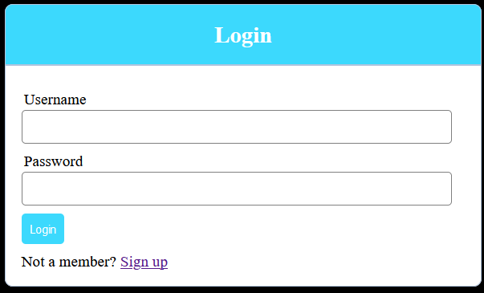
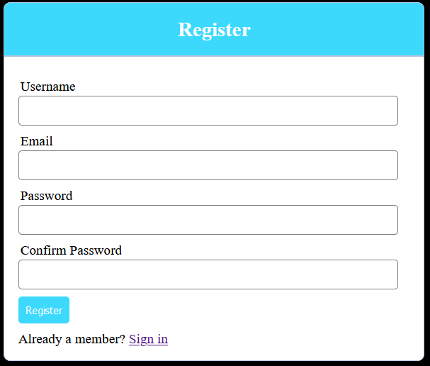
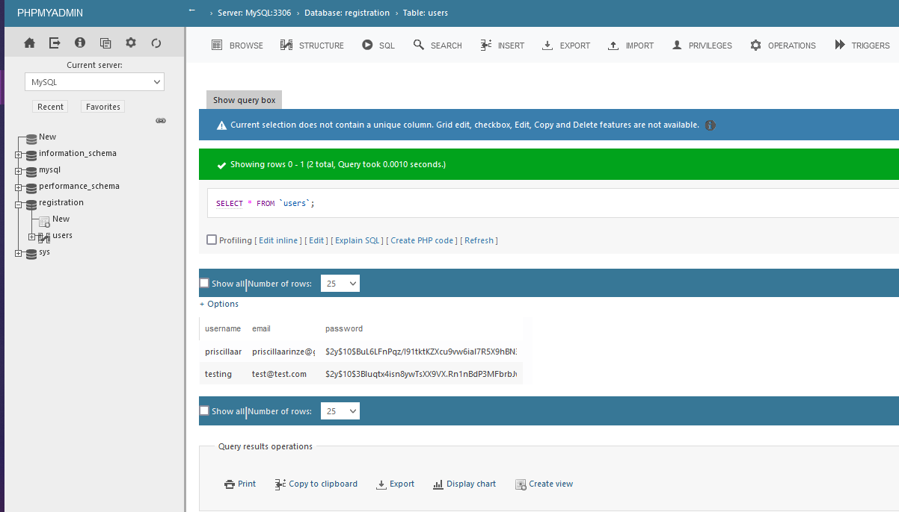

# Login-and-Register
This is a simple registration and login form that uses a PDO extension (supported by PHP 7.1) to send and obtain user information from the database. The users' passwords are stored in the database with the `password_hash()` function and the `PASSWORD_DEFAULT` bcrypt hashing algorithm.

__*Used WAMP server to run*__

`server.php`: Includes the logic for both the login & registration pages
* within REGISTER section, converts plain text passwords into a hash via `password_hash()` function using the default bcrypt hasing algorithm `PASSWORD_DEFAULT`

`login.php`: HTML for main login page
* includes/imports `server.php` 
* will direct user to `register.php` if they select "Sign Up" link

`register.php`: HTML for registration page

`index.php`: HTML for successful login page

 

 

 

